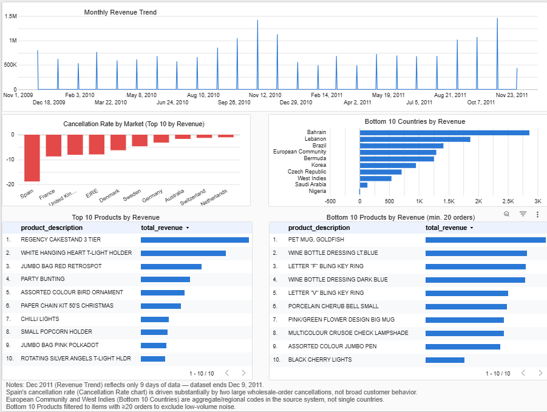

# Online Retail II — Sales & Revenue Performance Analysis

Which products and regions drive the most revenue for a real UK-based online retailer — and how much of that revenue is being eroded by order cancellations? A multi-stage BigQuery SQL analysis of over 1 million real transactions, visualized in a Looker Studio dashboard.

## Business Question

Which products and regions drive the most revenue for this online retailer, how has that performance trended over time — and how much of it is being eroded by order cancellations?

## Key Findings

- **Extreme market concentration.** The top 10 countries by revenue account for **97.5%** of total revenue (£18.8M of £19.3M) — the business is overwhelmingly dependent on a small number of markets, led by the United Kingdom at £16.4M.
- **Cancellations erode roughly 8% of revenue overall**, but the rate varies sharply by market — from under 1.5% (Netherlands, Switzerland) up to **18.85% in Spain**. Investigating the outlier found Spain's rate wasn't a broad customer-behavior problem: ~94% of it traced back to two large wholesale-order cancellations and a handful of staff manual entries.
- **Clear seasonality**, with revenue peaking every November (pre-Christmas buildup) and troughing in February, consistent across both full years in the dataset.
- **Top and bottom performers tell different stories.** The top 10 products are broad-appeal decor items (cakestands, t-light holders, bunting); the bottom 10 (filtered to products with ≥20 orders, to exclude low-volume noise) surfaced a specific pricing-review candidate — a product with 111 separate orders but only £15.25 in total revenue.

## Tools & Skills Demonstrated

- **BigQuery SQL** — CTEs, window functions (`ROW_NUMBER() OVER PARTITION BY`, `COUNT(*) OVER`), `QUALIFY`, `REGEXP_CONTAINS`, conditional aggregation, self-joins with `EXISTS`, and building layered Views on top of a cleaned base table
- **A flag-column data cleaning design**, rather than hard row exclusions — every anomaly (cancellations, bad-debt write-offs, non-product codes, duplicates, unmappable countries) is preserved and labeled, keeping the cleaned table reusable across different future questions instead of a one-off filtered dataset
- **Looker Studio** for the dashboard layer, connected directly to validated BigQuery Views
- **Google Sheets**, used to independently cross-validate BigQuery's null/negative/zero-value counts against the raw source file — confirming the cleaning pipeline introduced no data loss
- Real bug-hunting and correction, documented in full: a `NULL`-propagation bug in a derived flag (fixed with `COALESCE`), an incorrect regex whitelist that let non-product codes slip into a "top products" ranking, and a silent StockCode case-sensitivity bug that was splitting a single product's revenue across two separate rows

## Data Source

This project uses the [Online Retail II dataset](https://archive.ics.uci.edu/dataset/502/online+retail+ii), licensed under [CC BY 4.0](https://creativecommons.org/licenses/by/4.0/).

> Chen, D. (2012). Online Retail II [Dataset]. UCI Machine Learning Repository. https://doi.org/10.24432/C5CG6D

Real transactions from a UK-based and registered non-store online retailer, 01/12/2009–09/12/2011 (1,067,371 rows). Included in this repository's `data/` folder for reproducibility, used here for non-commercial portfolio purposes.

## Repository Structure

```
├── online-retail-analysis-log.ipynb   # Full process log — Ask, Prepare, Process, Analyze, Share
├── dashboard-screenshot.png           # Looker Studio dashboard
├── data/                              # Source CSVs (see Data Source above)
└── README.md
```

## Full Case Study

The complete, detailed process log — every query, finding, and decision — lives in the notebook in this repo. A compressed summary is also available here: **[Full Case Study](#)** *(add your Notion link)*

## Dashboard



*(Save your dashboard screenshot as `dashboard-screenshot.png` in this repo's root folder — this line will render it automatically.)*
